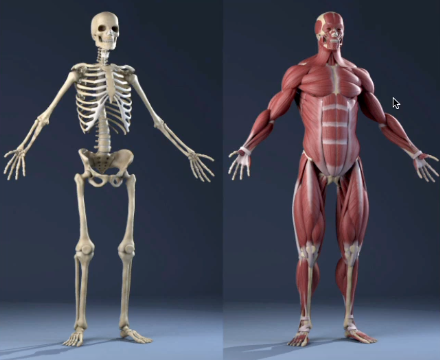

## 코코아톡 #1.5-1.9
------

 

해당 강의는 [코코아톡 클론코딩](https://nomadcoders.co/kokoa-clone/lobby) 를 보고 작성함.

 

> 💡 웹사이트는 ***text (language)*** 파일일 뿐이다. 

 -> **브라우저**는 사용자가 작성한 *코드를 인식하여 구현*하는 역할을 맡는다.  
브라우저는 인간 언어를 이해하지 못하기 때문에 브라우저가 이해할 수 있는 프로그래밍 언어로 변환하여 제공하는 것!

> 웹을 개발하는 데 사용되는 언어 <u>3가지</u> *(해당 강의에서는 html,css를 중심으로 설명)*
> * **HTML** : 브라우저에게 content *"구조가 어떤지"* 설명하는 역할
> * **CSS** : 브라우저에게 웹사이트의 content가 *"어떻게 보여야 하는지"* 설명하는 역할
> * **Javascript** : 브라우저의 '뇌' 역할을 담당 - interactivity(상호작용성)

  
* HTML - 뼈대 / CSS - 근육

 

위 3가지 중 웹 프로그래밍 언어는 **Javascript** 뿐! HTML, CSS는 프로그래밍 언어가 아니다.