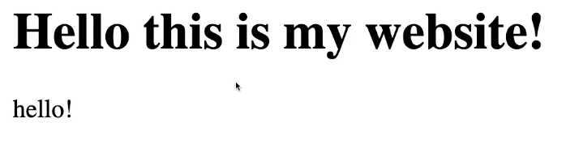
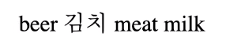
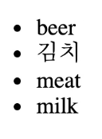
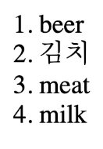

## 코코아톡 #2.0~2.4
------

<br>

해당 강의는 [코코아톡 클론코딩](https://nomadcoders.co/kokoa-clone/lobby) 을 보고 작성함.

<br>

브라우저는 **HTML 파일에 에러가 있다는 것을 알려주지 않는다.** 그렇기 때문에 언제나 사용자에게 컨텐츠를 보여줄 것이다. -> 뭐가 잘못 됐는지 알아 차리기가 쉽지 않음.

<br>

> **'tag'** 란? - html에서는 tag를 text로 넣는다. tag를 통해 content가 무엇을 의미하는지 나타낼 수 있음.
>>`<tag>content</tag>`

<br>

```html
<h1>Hello this is my website!</h1> <!--헤더tag-->

hello! <!--헤더tag 없이 작성하면 작은 글씨체로 반영됨-->
```


* `<h1>, <h2>, <h3>, <h4>, <h5>, <h6>` : 숫자가 작아질수록 글씨 크기도 작아진다. 헤더는 **h1 ~ h6** 사이만 가능.

<br>

>`<ul></ul>` : unordered list  

```html
<ul>
    beer
    김치
    meat
    milk
</ul>
```


<br>

>`<li></li>` : list item (목록 요소)

```html
<ul>
    <li>beer</li>
    <li>김치</li>
    <li>meat</li>
    <li>milk</li>
</ul>
```
  
-> `<li></li>` 태그로 리스트임을 명시해 줘야 리스트 형식으로 출력이 된다.

<br>

>`<ol></ol>` : ordered list

```html
<ol>
    <li>beer</li>
    <li>김치</li>
    <li>meat</li>
    <li>milk</li>
</ol>
```
  
-> `<ol></ol>` 태그를 사용하면 순서대로(ordered) 표기해준다.

<br>

>`<a></a>` : anchor (link) - 태그 안에 어떤 내용을 입력하면 링크가 됨.
>>그러나 tag에 추가하는 부가적인 정보인 **attribute(속성) *href*** 이 없으면 링크가 생성되지 않음.

```html
<a href="http://google.com">Go to google.com</a>
```
`href`는 `<a></a>`에만 추가 가능한 속성이다.

<br>

attribut tag 예시)
>`target` : 링크가 어떤 창에 열리는지 정해주는 기능
>>`target`의 디폴트는 `target="_self"`이며, *해당 창* 에서 링크가 열림.  
`target="_blank"` 는 *새로운 창* 에서 링크가 열림.

<br>

>`` : `` 태그는 **self-closing tag** 이기 때문에 closing tag인 `</img>`가 필요하지 않음.
>>* `src` : ``가 필요로 하는 attribute임. 
```html

```