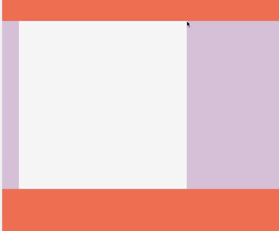

## 코코아톡 #3.0~3.5
------
해당 강의는 [코코아톡 클론코딩](https://nomadcoders.co/kokoa-clone/lobby) 을 보고 작성함.

<br>

#### CSS와 HTML을 함께 사용하는 법
1. 같은 html 파일에 html 코드와 css 코드를 함께 작성하는 방법
2. html 파일과 css 파일을 분리 시켜 작성하는 방법 *(추천)*

> ##### ✔️ html코드와 css코드를 함께 작성 (inline)

* `<style>` 태그가 `<head>`태그 안에 들어 있어야 함.
```html
<!DOCTYPE html>
<html lang="kr">
    <head>
        <title>Home - My first website.</title>
        <style></style> <!-css코드를 html코드에 추가 시 사용하는 태그-->
    </head>
    <body>
        <header>
            <h1>Hello</h2>
        </header>
        <main>
            <address>123 Road Altavista</address>
        </main>
        <footer>
            &copy; 2020 N.C
        </footer>
    </body>
</html>
```

<br>

>##### ✔️ html파일과 css파일을 분리하여 별도로 생성 (external) ✨추천✨ 

* `styles.css` 파일을 생성한 뒤 `<head>` 태그 안에 `<link href="styles.css rel="stylesheet" /">`를 추가한다.
```html
<!DOCTYPE html>
<html lang="kr">
    <head>
        <title>Home - My first website.</title>
        <link href="styles.css" rel="stylesheet" /> <!--별도로 생성한 css 파일 코드를 불러오는 것-->
    </head>
    <body>
        <header>
            <h1>Hello</h2>
        </header>
        <main>
            <address>123 Road Altavista</address>
        </main>
        <footer>
            &copy; 2020 N.C
        </footer>
    </body>
</html>
```
-> `styles.css`와 html의 관계를 보면 `styles.css`는 스타일시트(stylesheet)임. 이러한 관계를 `rel="stylesheet"`을 통해 명시하는 것.

<br>

> ##### ✔️ CSS 코드 작성 규칙

* css가 하는 일은 html 태그의 속성을 가리키는 일 **(selector)** 이다. 
*  `css(cascading style sheet)`는 cascading 속성을 띄기 때문에 **위에서부터 아래 순서** 로 코드를 읽고 적용시킨다.


**css파일 별도 생성 시**
```css
blueTitle /*pointer*/ {
    /*속성*/
}
```

<br>

**html 파일 내에 작성 시**
```html
ex)

<style>
   h1 {
    color: blue; 
    font-size: 20px; 
    <!--property: value;-->
   } 
</style>
```

-> css코드는 여러가지 **속성(property)** 과 그에 맞는 **값(value)** 이 존재한다.

<br>

---
#### Block과 Inline

> * **block = `<div>`, `<p>`** ... : 하나의 요소 옆에 다른 요소가 올 수 **"없는"** 태그
> * **inline = `<span>`, `<link>`, ``** ... : 하나의 요소 옆에 다른 요소가 올 수 **"있는"** 태그

🍎 div태그의 default display 설정은 block.  
🍏 span태그의 default display 설정은 inline.  
두 가지의 설정을 변경하고 싶을 시엔 다음과 같이 코드를 작성하면 된다.
```html
<style>
    div {
        display: inline;
    }
    span {
        display: block;
    }
</style>
```

##### ❗️주의해야 할 속성
* **inline**은 block과 달리 ***높이와 너비** 요소를 갖고 있지 않다.*
  -> inline 태그에 width나 height를 설정해도 나타나지 않음.
* **block**은 3가지 속성을 갖고 있다; 
    1. `margin`: block의 border(경계)로부터 바깥에 있는 공간
        * `margin: 20px 15px;` : 첫 번째로 쓴 `20px`는 **위,아래** 의 속성 / 두 번째로 쓴 `15px`는 **왼쪽, 오른쪽** 의 속성.
        * `margin: 20px 5px 12px 99px;` : 순서대로 **위, 오른쪽, 아래, 왼쪽 (시계방향)** 의 속성을 나타냄.
        * ⚠️ 종종 위,아래 margin 설정 시, 두 개 이상의 속성의 위아래 값이 같을 때 하나로 취급되는 **[collapsing margins](https://www.w3schools.com/css/css_margin_collapse.asp)** 현상이 나타나기도 하기 때문에 주의해야 함.  

        <br>

          
        -> *분홍색 block* 과 *흰색 block* 의 위아래 margin 값이 같아서 마진 상쇄 현상이 일어남.
    2. `border`
    3. `padding`
   
<br>

> 🔦 html 웹에서 우클릭 후, `inspect > elements` 설정을 통해 반영된 코드를 살펴볼 수 있으니 참고!