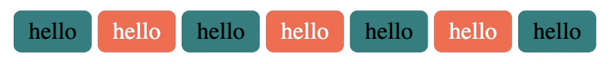
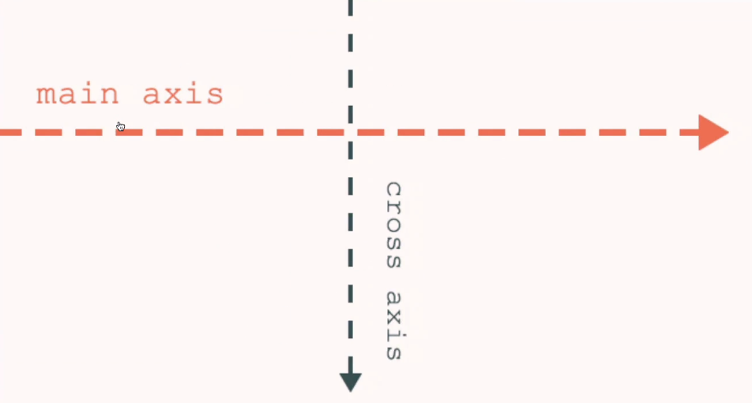

## 코코아톡 #3.6~3.11
------
해당 강의는 [코코아톡 클론코딩](https://nomadcoders.co/kokoa-clone/lobby) 을 보고 작성함.

<br>

### Padding

* `padding`은 `margin`과 반대 개념.
  > **margin**: block의 경계로부터 **바깥**에 있는 공간
  **padding**: block의 경계로부터 **안쪽**에 있는 공간

  * `padding: 20px 15px;` : 첫 번째로 쓴 `20px`는 **위,아래** 의 속성 / 두 번째로 쓴 `15px`는 **왼쪽, 오른쪽** 의 속성.
  * `padding: 20px 5px 12px 99px;` : 순서대로 **위, 오른쪽, 아래, 왼쪽 (시계방향)** 의 속성을 나타냄.

#### ❗️주의해야 할 속성 (복습)
* **margin의 inline**은 block과 달리 ***높이와 너비** 요소를 갖고 있지 않다.* -> 높이와 너비 요소를 적용시키고 싶다면 **block**으로 변경해줘야 한다.
* **padding** 은 상관 없이 사방으로 요소를 가질 수 있다.

<br>

---
### `html` 파일 내에서 각기 다른 `<div>` 태그에 css 속성을 적용하는 방법 - <u>id</u> 부여하기
* 각 속성에 id를 부여한 뒤 #을 통해 id를 호출하여 속성을 부여해주면 된다.
```html
<head> <!--앞에 '#'을 작성하면 id를 가리킨다는 것을 의미한다-->
    <style>
        #first {
            background0-color: whitesmoke;
        }
        #second {
            background0-color: teal;
        }
        #third {
            background0-color: wheat;
        }
        #fourth {
            background0-color: blanchedalmond;
        }
    </style>
</head>

<body>
    <div id="first">
        <div id="second">
            <div id="thrid">
                <div id="fourth">/<div>
            </div>
        </div>
    </div>
</body>
```

<br>

---
### Border

>[border 디자인 참고 링크](https://developer.mozilla.org/ko/docs/Web/CSS/border-style)

* css 적용할 때 *을 사용하면 모든 요소를 가리킴을 뜻함.
```html
ex) 모든 요소에 2px solid black border가 생성됨.

<style> 
/* border syntax:  <line-width> || <line-style> || <color> */
* {
   border: 2px solid black;
}
</style>
```

<br>

---
#### Classes

Classes 속성을 써야 할 상황 예시를 들어보자.

> **수정 전**
```html
<head>
    <style>
        #tomato {
            background-color: tomato;
        }
        #tomato2 {
            background-color: tomato;
        }
        #tomato3 {
            background-color: tomato;
        }
    </style>
</head>

<body>
    <span id="tomato">hello</span>
    <span id="tomato2">hello</span>
    <span id="tomato3">hello</span>
</body>
```
-> 이렇게 작성해도 작동은 하나, 세 번이나 같은 코드를 반복해서 썼기 때문에 효율적이지 않다.

<br>

>**수정 후 1 - Grouping**
```html
<head>
    <style> /* ,를 이용한 id grouping이 가능 */
        #tomato,
        #tomato2,
        #tomato3 {
            background-color: tomato;
        }
    </style>
</head>

<body>
    <span id="tomato">hello</span>
    <span id="tomato2">hello</span>
    <span id="tomato3">hello</span>
</body>
```
-> 수정 전 코드보다는 깔끔해졌으나, 여전히 tomato라는 글자를 세 번이나 반복하고 있기 때문에 효율적이지 않다.

<br>

>**수정 후 2 - Class**
```html
<head>
    <style> /* .tomato를 이용한 class 기능 */
        .tomato {
            background-color: tomato;
        }
    </style>
</head>

<body> <!--동일한 class명 사용 가능-->
    <span class="tomato">hello</span>
    <span class="tomato">hello</span>
    <span class="tomato">hello</span>
</body>
```
-> ✨ 코드는 <u>반복되지 않고 깔끔할수록</u> 잘 짜여진 코드라고 할 수 있다. ✨
* **`#tomato`** = `id="tomato"` ; id는 고유하기 때문에 2개 이상 존재할 수 없다.
* **`.tomato`** = `class="tomato"` ; class는 같은 이름의 class가 2개 이상 존재할 수 있다.

<br>

>**Classes을 이용한 깔끔한 코드 예시**
```html
<head>
    <style>
        .btn {
            padding: 5px 10px;
            border-radius: 5px;
        }
        .teal {
            background-color: teal;
        }
        .tomato {
            background-color: tomato;
        }
    </style>
</head>

<body> <!--class 안에 여러 개의 이름 부여-->
    <span class="btn tomato">hello</span>
    <span class="btn teal">hello</span>
    <span class="btn teal">hello</span>
    <span class="btn tomato">hello</span>
    <span class="btn teal">hello</span>
    <span class="btn tomato">hello</span>
</body>
```


<br>

---
### inline-block
* `inline-block`은 block처럼 인식하게 해주면서 동시에 바로 옆에 다른 요소가 올 수 있도록 해준다.

⚠️ 하지만 이 방식은 고루하며 정해진 형식이 없고 여러가지 문제가 많다. (반응형 디자인도 지원하지 않음 ㅠㅠ)
➡️ 그래서 탄생하게 된 게 **Flexbox** ! 😎

<br>

### flexbox
>**flexbox 사용 시 지켜야 할 규칙**
* 자식 element에 명시하지 않고 부모 element에만 명시해야 함.
   ➡️ 그러기 위해서는 부모 element를 **flex container**로 만들어줘야 한다.
```html
ex)
<head>
    <style>
        body {
            margin: 20px;
            display: flex; /* flex container */
            justify-content: center; 
            align-items: center;
            /* body의 자식 element들을 모두 가운데 정렬 시켜주는 코드. 이 외에도 여러가지 종류가 많이 존재함. */
        }
    </style>
</head>
<body> <!--<body> = 부모 element-->
    <div></div>
    <div></div>
    <div></div>
    <!--<body>의 하위 태그 <div> = 자식 element-->
</body>
```
<br>

* **주축(main axis)** 과 **교차축(cross axis)**
   
  ➡️ deafult는 수평과 수직   
  ➡️ 축들이 갖고 있는 수평과 수직 성질을 변경하고 싶으면 `justify-content`를 사용하면 된다.   
  ➡️ `justify-content`는 주축(main axis) 위에서 움직이고, `align-items`은 교차축(cross axis) 위에서 움직인다.   
  ➡️ `align-items` 사용 시 `height` 설정을 해줘야 해당 `height`를 기준으로 이동함.   
```html
ex)
<head>
    <style>
        body {
            height: 100vh; /* vh = viewport(screen) height */
            margin: 20px;
            display: flex; 
            flex-direction: column; /* dafult; row */
            justify-content: center; 
            align-items: center;
        }
    </style>
</head>
```
<br>

>🍎 **Flexbox 요약**
>* **Flexbox**를 적용시키기 위해서는 자식이 아니라 부모에게만 명시하면 된다.
>* `justify-content`과 `align-items`을 적용하고 싶으면 `display:flex`를 먼저 작성해서 **flex container**로 만들어줘야 한다.
>* flex container는 두 개의 축을 갖고 있다; **주축(main axis) & 교차축(cross axis)**    
*(default: 주축=수평/교차축=수직).*
>* `justify-content`는 주축에 적용되고 `align-items`는 교차축에 적용된다. (무조건 수평, 수직❌)
