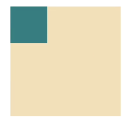
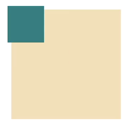
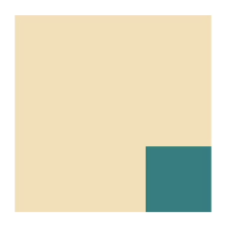
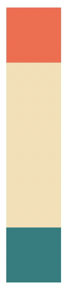

## 코코아톡 #3.12~3.16
------
해당 강의는 [코코아톡 클론코딩](https://nomadcoders.co/kokoa-clone/lobby) 을 보고 작성함.

<br>

#### position: fixed

➡️ 스크롤을 해도 요소가 그 자리에 그대로 위치해 있도록 설정하는 코드: **새로운 layer를 생성**하기 때문에 기존과는 다른 layer에 요소를 배치함.

```html
<head>
    <style>
        body {
            height: 100vh;
            margin: 20px;
        }
        div {
           position: fixed; 
           width: 300px;
           height: 300px;
           color: white;
           background-color: teal;
        }
    </style>
</head>
<body>
    <div></div>
</body>
```
<br>

---
#### position: static

레이아웃이 박스를 처음 위치하는 곳에 두는 것을 뜻함.
<br>

#### position: relative

element가 처음 위치한 곳을 기준으로 수정하는 것을 뜻함.
```html
<head>
    <style>
        body {
            height: 1000vh;
            margin: 50px;
        }
        div {
            width: 300px;
            height: 300px;
            background-color: wheat;
        }
        .green {
            background-color: teal;
            height: 100px;
            width: 100px;
        }
    </style>
</head>
<body>
    <div>
        <div class="green"></div>
    </div>
</body>
```

<br>

##### ⬇️ **`position: relative`** 적용 ⬇️
```html
<head>
    <style>
        body {
            height: 1000vh;
            margin: 50px;
        }
        div {
            width: 300px;
            height: 300px;
            background-color: wheat;
        }
        .green {
            background-color: teal;
            height: 100px;
            width: 100px;
            position: relative; /* 상대적인 위치 조정 */
            top: -10px;
            left: -10px;
        }
    </style>
</head>
<body>
    <div>
        <div class="green"></div>
    </div>
</body>
```
   
➡️ `green` block이 위, 좌로 10px씩 줄어든 것을 볼 수 있음.
<br>

#### position: absolute

가장 가까운 relative 부모 기준으로 이동시켜주는 것.
```html
<head>
    <style>
        body {
            height: 1000vh;
            margin: 50px;
        }
        div {
            width: 300px;
            height: 300px;
            background-color: wheat;
        }
        .green {
            background-color: teal;
            height: 100px;
            width: 100px;
            position: absolute;
        }
    </style>
</head>
<body>
    <div>
        <div class="green"></div>
    </div>
</body>
```
➡️ absolute class `green`의 가장 가까운 relative 부모는 `body`이기 때문에 `body`를 기준으로 이동하게 된다. *(relative한 부모를 찾을 때까지 상위로 올라가다가 못 찾으면 `body`를 기준으로 이동함)*
<br>

* **absolute class `green`의 가장 가까운 relative 부모를 `div`로 설정해 줄 경우**
```html
<head>
    <style>
        body {
            height: 1000vh;
            margin: 50px;
        }
        div {
            width: 300px;
            height: 300px;
            background-color: wheat;
            position: relative; /* div를 relative로 설정 */
        }
        .green {
            background-color: teal;
            height: 100px;
            width: 100px;
            position: absolute;
            bottom: 0px; 
            right: 0px; /* 오른쪽 아래 가장 끝으로 이동 */
        }
    </style>
</head>
<body>
    <div>
        <div class="green"></div>
    </div>
</body>
```
   
<br>

---
#### pseudo selectors

좀 더 세부적으로 element를 point해주는 것.
* **처음과 마지막 `<div>`에게만 다른 배경색을 부여하는 방법**
```html
<head>
    <style>
        body {
            height: 1000vh;
            margin: 50px;
        }
        div {
            width: 150px;
            height: 150px;
            background-color: wheat;
            position: relative; 
        }
        div:first-child {
            background-color: tomato;
        } /* first-child = 첫 번째 element */
        div:last-child {
            background-color: teal;
        } /* last-child = 마지막 element */
    </style>
</head>
<body>
    <div></div>
    <div></div>
    <div></div>
    <div></div>
    <div></div>
</body>
```
   

* **2,3번 째 element를 선택하고 싶다면: `div: nth-child(2)`, `div: nth-child(3)` 처럼 작성하면 된다.**  
* 홀수번 째만 선택하고 싶을 땐 `div: nth-child(odd)` 이나 `div:nth-child(2n+1)`, 짝수번 째만 선택하고 싶을 땐 `div: nth-child(even)` 이나 `div: nth-child(2n)`도 가능하다.

➡️ 이 방식이 `class`나 `id`를 만드는 것보다 훨신 더 효율적인 방법이다.
* [index of standard pseudo-classes 문서 참고](https://developer.mozilla.org/en-US/docs/Web/CSS/Pseudo-classes)
<br>

---
#### pseudo selectors
attribute을 통해 어떤 것이든 선택할 수 있게 해주는 것.

```html
<style>
    input:required {
        border-color: tomato;
    } /* input 태그에서 required 속성을 갖고 있는 요소에 대해 부여 */
    input[placeholder~=:"name"] {
        background-color: pink;
    } /* input 태그에서 placeholder의 이름에 "name"이라는 단어가 들어가는 요소에 대해 부여 */
</style>
```

* 이 외에도 정말 많은 selector들이 있으니 [Attribute selectors 문서 참고](https://developer.mozilla.org/en-US/docs/Web/CSS/Attribute_selectors) 할 것 !
<br>

---
#### combinators
동일한 이름이지만 위치가 다른 태그에 각기 다른 다른 속성 부여하기
```html
ex)

<head>
    <style>
        span {
            color: tomato;
        } 
        p span {
            color: teal;
        } /* p(부모) span(자식) - p태그 안에 있는 span은 따로 인식 */
    </style>
</head>
<body>
    <div>
        <span>hello</span>
        <p>
            Lorem ipsum dolor sit amet consectetur adipiscing elit. Quod commodi et sequi ipsam odio dolorem.
            <span>inside</span>
        </p>
    </div>
</body>
```
   

> **🍏 combinator pointer 종류**
*  **`p span`** 은 `<p>` 태그 아래에 있는 `<span>` 태그 전부를 지칭한다. 
* **`p > span`** 은 `<p>`태그 **바로 아래(inside)** 에 있는 `<span>` 태그만 불러온다.
* **`p + span`** 은 `<p>` 태그 **바로 다음(next)** 에 오는 `<span>` 태그를 불러온다.
* **`p ~ span`** 은 `<span>`이 `<p>` 옆에 오는 형제이긴 하나 **바로 뒤에 오는 건 아닌** 태그를 불러올 때 사용한다.

