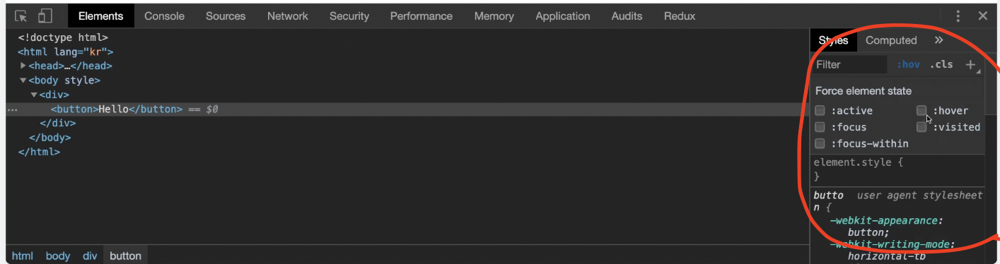
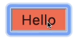

## 코코아톡 #3.17~4.4

------
해당 강의는 [코코아톡 클론코딩](https://nomadcoders.co/kokoa-clone/lobby) 을 보고 작성함.

<br>

### state
개발자 도구에서 확인할 수 있는 가장 중요한 selector를 뜻함.


* **active** : 마우스로 버튼을 눌렀을 때(click) 활성화되는 색상

    ```html
    <style>
        button:active {
            background-color: tomato;
        }
    </style>
    ```

    ➡️ 버튼을 눌렀을 때 색상이 `tomato` 색으로 바뀜.
    
<br>

* **hover** : 마우스 커서가 대상 위에 있을 때(on) 활성화되는 색상
* **focus** : 키보드로 선택되었을 때 활성화되는 색상
* **visited** : 방문한 적 있는 링크의 색상이 변경되는 것
    ```html
    <head>
        <style>
            a:visited {
                color: tomato;
            }
        </style>
    </head>
    <body>
        <a href="https://apple.com">Go to apple</a>
    </body>
    ```
    ➡️ `https://apple.com`을 방문한 적 있다면 `Go to apple` 링크 색상이 `tomato` 색상으로 변경될 것임.
* **focus-within** : focused인 자식을 가진 부모 element의 상태를 나타냄. (자식 element 안에 어떤 것이든 focused 상태가 되면 부모 element를 이렇게 만들어줘라~ 는 뜻)
<br>

---
### colors and variables
* #### root & var
```html
<head>
    <style>
        :root {
            --main-color: #489ee3;
        } /* root은 문서의 기본 바탕을 뜻함 */
        p {
            background-color: var(--main-color);
        }
        a {
            color: var(--main-color);
        } /* 변수(variable=custom property)를 입력해서 해당 색상을 불러올 수 있음 */
    </style>
</head>
```
<br>

---
### transitions
어떤 상태에서 다른 상태로 가는 변화를 애니메이션화 하는 것.   
* ❗️ transisiton이라는 속성은 **state가 없는 요소**에 붙어야 한다. + *state가 없는 요소*와 *있는 요소*에 모두 동일한 속성이 존재해야 transition이 적용된다.
```html
<!DOCTYPE html>
<html lang="kr">
    <head>
        <title>The Nico Times</title>
        <style>
            a {
                color: wheat;
                background-color: tomato;
                text-decoration: none;
                padding: 3px 5px;
                border-radius: 5px;
                font-size: 55px;
                transition: background-color 10s ease-in-out, color 5s ease-in-out; /* 각각 10초와 5초에 걸쳐 배경색상과 글자색상 변경이 일어남 */
            }
            a:hover {
                color: tomato;
                background-color: wheat;
            } 
/* 마우스가 버튼 위에 있을 땐 글자 색상=wheat 배경색상=tomato, 없을 땐 글자색상=tomato 배경색상=wheat으로 바뀜 */
        </style>
    </head>
    <body>
        <a href="#">Go home</a>
    </body>
</html>
```
`tansition: all 5s ease-in-out;`을 사용하면 변경이 일어나는 **모든 요소(all)** 에 5초의 시간을 부여한다.
* `ease-in-out`은 무슨 역할을 하는가? - [CSS easing animation 참고문서](https://matthewlein.com/tools/ceaser)
<br>

---
### transformations
무언가를 "변형"시키는 기능.   
**transformation은 box element을 변형시키지 않는다.** => 일종의 3D transformation이기 때문에**margin, padding이 적용되지 않고 픽셀을 변형**시키는 것!
```html
ex)

<!DOCTYPE html>
<html lang="kr">
    <head>
        <title>The Nico Times</title>
        <style>
            img {
                border: 5px solid black;
                border-radius: 50%; /* 사각형 이미지를 원형으로 바꿔줌 */
                transform: rotateY(35deg); /* Y축 기준으로 35도 회전시켜줌 */
            }
        </style>   
    </head>
    <body>
        
    </body>
</html>
```
`transition: transform 5s ease-in-out;` 처럼 **transform에도 transition 효과를 부여**할 수 있다.
* 💡 [다양한 transform 효과 참고문서](https://developer.mozilla.org/ko/docs/Web/CSS/transform)
<br>

---
### animations
**`@keyframes`** : 마우스를 위로 올리거나 transition 없이도 계속 재생되는 애니메이션.
#### 1. `from` & `to` 를 적용한 방법
```html
<!DOCTYPE html>
<html lang="kr">
    <head>
        <title>The Nico Times</title>
        <style>
            @keyframes superSexyCoinFlip {
                from {
                    transform:rotateX(0);
                }
                to {
                    transform:rotateX(360deg);
                }
            } /* 애니메이션 keyframe 생성 */
            img {
                border: 5px solid black;
                border-radius: 50%; 
                animation: superSexyCoinFlip 5s ease-in-out infinite; /* 별도의 클릭이나 transition 없이 내가 생성한 keyframes를 animation으로 5초간 적용되며 무한으로 반복됨 */
            }
        </style>   
    </head>
    <body>
        
    </body>
</html>
```
<br>

#### 2. `%` 를 적용한 방법
```html
<!DOCTYPE html>
<html lang="kr">
    <head>
        <title>The Nico Times</title>
        <style>
            @keyframes superSexyCoinFlip {
                0% {
                    transform:rotateY(0);
                }
                50% {
                    transform:rotateY(180deg) translateY(-100px);
                }
                100% {
                    transform:rotateY(0)
                }
            } /* 애니메이션 keyframe 생성 */
            img {
                border: 5px solid black;
                border-radius: 50%; 
                animation: superSexyCoinFlip 5s ease-in-out infinite;
            }
        </style>   
    </head>
    <body>
        
    </body>
</html>
```
➡️ 단순히 `from`과 `to`를 사용할 때보다 더욱 매끄러운 애니메이션 효과를 생성할 수 있다. *(% 스텝은 원하는 개수만큼 생성 가능)*
* 🧚🏻‍♂️ [css animation 효과 참고](https://animista.net/)